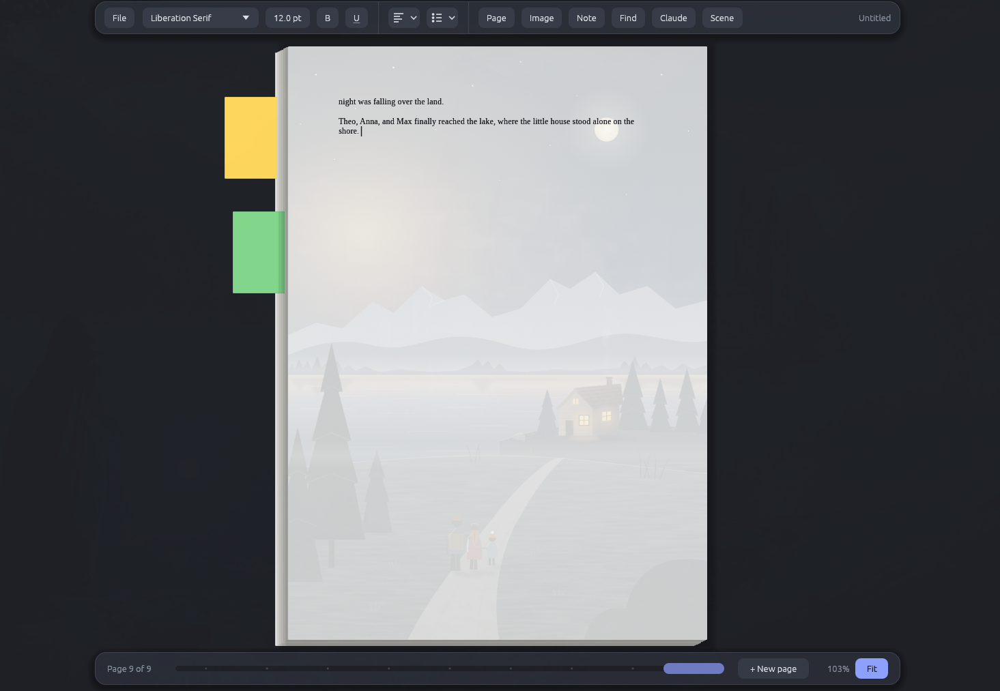
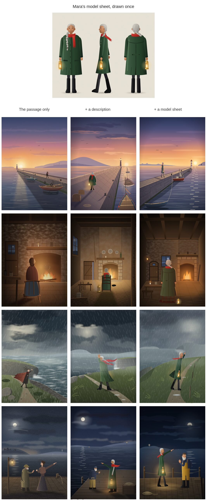

# Caprice

**A word processing app for creative, fun story telling.**

Caprice is a word processor for writing stories, not reports. It gives you real pages that turn like a book’s or slide onto a stack, post-it notes for your ideas, and Claude as a helper: it can paint the scene you are writing behind the page, or read along when you circle a passage.



## Why Caprice

- **Easy to use.** One small toolbar, real pages and no clutter. Start typing, and the story fills page after page.
- **Joy in writing.** Pages turn over like a book’s, or slide onto a stack (pick the look under Page → View: *Book* or *Paperstack*). The pages you have already written pile up beside the one you are on, so you can watch the story grow.
- **Room for ideas.** Stick post-its to any line for plot twists, names and "what if…" thoughts. They peek out of the page piles, and clicking one takes you back to its page.

## Features

- **Scenes behind the page.** Describe a place ("a village between the mountains and the sea, at dusk") and Claude paints it faintly behind your writing. Or let it follow along, painting each paragraph as you finish it. Every scene is kept with its part of the story, and the picture changes as your caret moves on. You can save a picture as a PNG or SVG.
- **The same people in every scene.** Describe the people of your story once under Scene → Cast (a name, other names the story uses for them, how they look), and let Claude draw each one a model sheet. Every scene whose passage names them then paints them from it, so Mara looks like Mara in every picture of the book, though the story never says again how she looks. A paragraph that only says "she" or "the boy" is painted with whoever the paragraph before named, and the list of scenes shows who each scene was painted with, to choose others and paint it again.

  
- **Circle to ask Claude.** Turn on the pen (Ctrl+Shift+P) and draw a loop around a passage. Claude can review it, fix awkward wording, check grammar, summarize it, or answer your own question about it. A rewrite can replace the passage, and one undo brings the original back.
- **Post-it notes** on any selection or line (Ctrl+Alt+N), in several colours.
- **Leafing through pages** with the scrollbar at the bottom, a two-finger swipe or Page Up / Page Down. In *Paperstack*, dragging the scrollbar slides each page it passes halfway out, and letting go moves them all together.
- **Pictures** in your text that you can move, resize and rotate.
- **Formatting** that stays out of the way: fonts, sizes, bold, underline, alignment, lists and page setup.
- **Search** (Ctrl+F), **undo** and **zoom** (Ctrl + / − / 0).
- **Your work is safe.** Caprice asks before closing or opening another file when you have unsaved changes.
- **Export to Word** (.docx) when the story is ready to share.

## Getting started

Caprice is written in Rust and runs on Linux and macOS.

```sh
cargo run --release              # try it
cargo run --release -- story.caprice   # open a story directly
./install.sh                     # install it: a launcher entry on Linux, an app in ~/Applications on macOS
```

On Linux, `install.sh` places the binary in `~/.local/bin` and adds a launcher entry and icon under `~/.local/share`.

On macOS, it builds `~/Applications/Caprice.app` (no sudo needed), so Caprice shows up in Launchpad and Spotlight and opens `.caprice` files by double-click. Re-run `./install.sh` after pulling updates to refresh it.

### Claude features

The scene painting and the pen use [Claude Code](https://claude.com/claude-code) on your machine. Install it and sign in by running `claude` once in a terminal. Caprice stores no keys of its own; it runs your local `claude` command with tools, project settings and session history turned off. Everything else in Caprice works without Claude.

## Files

Stories are saved as `.caprice` files: plain JSON holding the text, notes, pictures, the scenes behind the pages and the cast.
